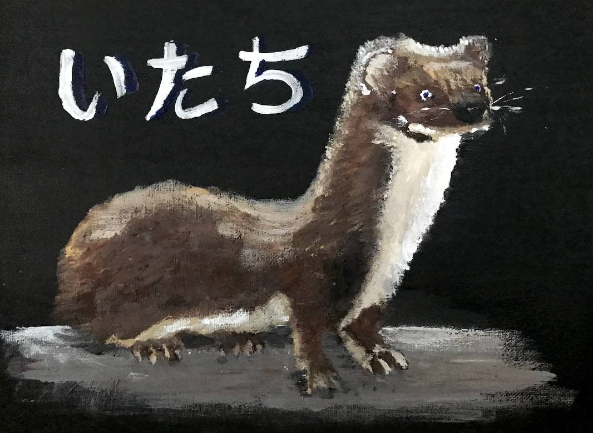

# Weasel - A weasel simulator.


## Why?
Because.

## How do I run this?
Just run it with Python:
```shell
python weasel.py
```

## What should I expect?
A simple ecosystem of small mammals is spawned. They follow a simple pattern:
* Grow and expect to be fed by an adult until self adults
* If have no nest, create a nest (or find an already-occupied one if weasel)
* Hunt for a food source - vegetation if a small rodent (or small rodent if a weasel)
* Die if gone hungry for more than a month.
* If mating season, find a mate and breed.
* Sleep.

Most mammals will get a random name consisting of mostly hissing noises: Hishissskhis, Shisshisssk, Isssksishis and so on. They make hissing noises (or little peeps if not adult).

Weasels will get adorable random-generated names, such as Wubi, Bodibi, Bilabobi (actual examples). The have two sounds: Growl (if adult) and Squeak (if still a baby weasel).

At the end of each day, stats of the current population are printed, for example:
```
Another day passes. It is day 1302.
The world consists of: 
    2960 moles
    1437 squirrels
    663 rabbits
    1883 rats
    2740 shrews
    1011 chipmunks
    5 weasels
```

## I ran it and it abruptly ended. What went wrong?
Any of the animals may just randomly die. Also, weasels may hunt the other populations to death and then they'll go hungry.
Example:

## The simulation just keeps going and going. What's wrong?
Sometimes all the populations keep growing to the point where they don't really get significantly smaller anymore. If the numbers at the end of each day seem somewhat consistent, congratulations, you have equilibrium. If they keep growing, the simulation will run until you either run out of memory or interrupt it (Ctrl-C).

## No, seriously, why?
It's possible weasels aren't appreciated enough. They're small, courageous and take care of themselves. Also, partly due to the Dilbert comic strip.

# TODO:
* Turn the simulation into realtime 3D
* Add VR headset support

